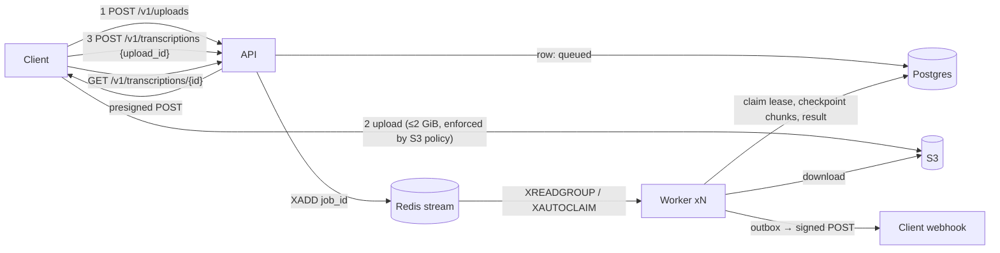

# Transcription service: design

Audio in (WAV, MP3, M4A, FLAC, OGG/Opus, WebM, video containers), timestamped transcript out,
behind an async job API. The model is off the shelf (Whisper via faster-whisper, or a hosted
engine); the engineering problem is everything around it: hostile input, long audio, failure
recovery, backpressure, and transcript quality.

## Architecture



* **API** (FastAPI): auth, admission control, idempotency, direct small uploads, presigned
  large uploads, job reads, subtitles. Never transcribes.
* **Worker** (one process per CPU/GPU slot, one model per process): consumes the stream, owns
  a job through a Postgres lease, runs the pipeline with per-chunk checkpoints, writes the
  transcript, and drains the webhook outbox.
* **Postgres** is the source of truth for job state. **Redis** only carries wake-up
  messages and rate-limit counters, so losing a message is recoverable (sweeper).
* **S3** holds audio (SSE-encrypted, lifecycle-expired after `TX_AUDIO_RETENTION_DAYS`).
  Transcripts persist in Postgres.

## Audio pipeline (`transcription/audio`, `transcription/pipeline.py`)

| Step | Decision | Why |
|---|---|---|
| Probe | `ffprobe` on the bytes; extension and Content-Type ignored | Clients mislabel files; the bytes don't lie |
| Allowlist | `-format_whitelist wav,aiff,mp3,flac,ogg,mov,matroska,aac` on **both** ffprobe and ffmpeg | ffmpeg itself refuses `hls`/`concat`/`image2`/`tty` → no SSRF / local-file read via playlists |
| Decode once | First audio track → 16 kHz mono s16le raw file on disk | Whisper's native input; every format costs zero code |
| Duration | From decoded sample count, `-t` cap + 1 s | VBR MP3 / WebM headers lie or are absent; a lying header can't force an endless decode |
| Isolation | ffmpeg/ffprobe as subprocesses with timeouts | A hung/crashing decoder kills a child, not the worker |
| Channels | Mono downmix by default; `split_channels` decodes each channel separately | Call-centre stereo = one speaker per channel → free speaker separation |
| No enhancement | No denoise / loudness normalisation | Whisper is trained on noisy audio; front-ends add artifacts it never saw. Measure first (see `eval/`) |
| Memory | PCM memory-mapped; VAD in 10-min blocks; engine sees one ≤30 s slice | 1 h = 115 MB int16 on disk instead of ~1.3 GB float32 stereo in RAM |
| VAD | Silero (bundled with faster-whisper) | Silence/music never reach the model → less compute, fewer hallucinations |
| Chunking | Pack speech regions into ≤30 s contiguous slices; never pack across a >2 s gap; nonstop speech is cut at the quietest 100 ms frame of the last 5 s | Exactly one Whisper window; cuts land between words; no overlap → nothing to de-duplicate at seams |
| Timestamps | `absolute = chunk.start + t`, clamped to chunk end | Chunks are contiguous slices of the original timeline |
| Language | Detected on the first chunk, then pinned (persisted, survives resume) | One detection pass; short chunks can't flip language mid-file |
| Independence | `condition_on_previous_text=False`; glossary via `initial_prompt` | A repetition loop can't spread across chunks; prompt restores cross-chunk spelling consistency |

## ASR engines (`transcription/asr`)

`ASREngine.transcribe(chunk) -> ChunkTranscript` is the only seam. Implementations:

* `FasterWhisperEngine`: CTranslate2 Whisper, int8 on CPU / float16 on GPU. Decoding with
  temperature fallback `(0.0, 0.2, …, 1.0)` driven by `compression_ratio_threshold=2.4` and
  `log_prob_threshold=-1.0`; `vad_filter=False` (the pipeline already ran VAD once over the
  whole file). Model loaded once per worker process.
* `ElevenLabsEngine`: hosted Scribe (`POST /v1/speech-to-text`) over httpx; words are grouped
  into segments at sentence punctuation or >0.8 s gaps. 429/5xx/timeouts →
  `EngineUnavailableError`; other 4xx → `EngineError`.
* `FallbackEngine(primary, fallback)`: circuit breaker per primary
  (`breaker_failure_threshold` consecutive unavailability errors → open for
  `breaker_reset_s`, then half-open probe). Unavailable → served by fallback (metric
  `tx_engine_fallbacks_total`); the per-chunk `engine` field records who served it.

**Quality guards** (`asr/postprocess.py`, applied per chunk, engine-agnostic where fields
exist): drop segments that look like silence hallucinations (`no_speech_prob >
no_speech_threshold` and `avg_logprob < logprob_threshold`), repetition loops
(`compression_ratio > threshold`, or the same text repeated ≥3× consecutively), and known
filler hallucinations ("thanks for watching", "subtitles by …") when low-confidence; flag
`low_confidence` when `avg_logprob < low_confidence_logprob`; drop empty text; clamp and
order timestamps. Dropped counts by reason are reported in `stats.dropped_segments`.

## Job lifecycle and failure handling

```
queued ──claim──▶ processing ──▶ succeeded
   ▲                  │  └──────▶ failed  (bad input, or attempts exhausted → DLQ)
   └──release─────────┘ (transient error: message left unacked → redelivered after visibility timeout)
```

**Claim/lease** (`Repository.claim`): `UPDATE … SET status='processing', worker_id, lease,
attempts+1 WHERE id=… AND attempts<max AND (status='queued' OR lease expired)`. Every
worker write is fenced on `(status='processing', worker_id)`; losing the lease raises
`LeaseLostError` and the worker stops without acking.

**Worker loop** (`worker/main.py`), per message:

| Claim outcome / processing result | DB | Stream |
|---|---|---|
| `BUSY` / `TERMINAL` / `MISSING` | – | ack |
| `EXHAUSTED` | `fail(max_attempts_exceeded)` | dead-letter (XADD dlq + ack) |
| success | `complete` (+ webhook outbox row) | ack |
| `InputError` (415/422/413) | `fail` | ack (retrying can't help) |
| `LeaseLostError` | – | **no ack** (the new owner holds the message) |
| retryable / unexpected error | `release` (back to queued, error recorded) | **no ack** → XAUTOCLAIM after `visibility_timeout_s` gives natural backoff |

* **Heartbeat** thread every `heartbeat_interval_s`: `repo.heartbeat` (extend lease) +
  `queue.touch` (reset stream idle). Lost lease → cancel the job cooperatively.
* **Reclaim**: each loop iteration first XAUTOCLAIMs messages idle > visibility timeout
  (dead workers), then XREADGROUPs new ones.
* **Sweeper** (Redis lock, one worker at a time, every `sweep_interval_s`): re-enqueues jobs
  whose message was lost (API crashed between commit and XADD; queued untouched for
  `stale_queued_after_s` while the group has no undelivered backlog) and jobs stuck in
  `processing` with a long-expired lease. Duplicates are harmless.
* **Checkpointing**: the chunk plan and language are persisted on the job; each finished
  chunk is upserted into `job_chunks` with `chunks_done` in the same transaction. A
  redelivered job re-decodes (cheap) and transcribes only the missing chunks.
* **Chunk retries**: `chunk_max_retries` with exponential backoff + jitter, inside the
  job. Only after they're exhausted does the job-level release/redelivery kick in.
* **Graceful shutdown**: SIGTERM stops taking new messages; the current chunk finishes and
  is checkpointed, then the job is released so another worker resumes it immediately.
* **Webhook outbox**: `complete`/`fail` mark `webhook_status='pending'` in the same
  transaction. A dispatcher thread in each worker claims due rows (SKIP LOCKED), sends one
  signed attempt, and reschedules with exponential backoff up to `webhook_max_attempts`.

## HTTP API (`/v1`)

Auth: `Authorization: Bearer <api key>` (sha256-hashed at rest). Errors are RFC 9457
`application/problem+json`: `{"type","title","status","detail","code","request_id"}`.
Every response carries `X-Request-ID`.

| Method & path | Purpose | Success |
|---|---|---|
| `POST /v1/uploads` `{"size_bytes", "content_type"?}` | Presigned S3 POST for large files | 201 `{upload_id, url, fields, expires_at, max_bytes}` |
| `POST /v1/transcriptions` JSON `{"upload_id", language?, prompt?, split_channels?, word_timestamps?, webhook_url?}` | Transcribe an uploaded object | 202 job |
| `POST /v1/transcriptions?language=…` raw audio body (`audio/*` or `application/octet-stream`) | Direct upload ≤ `max_direct_upload_bytes`, streamed to disk + sha256, probed before accepting | 202 job |
| `POST /v1/transcriptions/batch?language=…` multipart, repeated `file` parts | Each file admitted as a direct upload on its own; the whole body ≤ `max_direct_upload_bytes`, ≤ `max_batch_files` files, one rate-limit unit per file | 207 `{data: [{filename, status, job, error}]}` |
| `GET /v1/transcriptions/{id}` | Status, progress, error, result | 200 |
| `GET /v1/transcriptions?limit=&before=&status=` | List own jobs, newest first, cursor pagination | 200 |
| `GET /v1/transcriptions/{id}/subtitles?format=srt\|vtt` | Captions | 200 text; 409 if not succeeded |
| `DELETE /v1/transcriptions/{id}` | Delete transcript + audio now | 204 |
| `GET /healthz` / `GET /readyz` / `GET /metrics` | Liveness / DB+Redis+S3 / Prometheus | |

Admission control on create, in order: auth → rate limit (per key, 429 + `Retry-After` +
`RateLimit-*` headers) → `Idempotency-Key` replay (same fingerprint → original job with
200; different → 409) → global backpressure (`queued+processing ≥ max_pending_jobs` → 429
`queue_full`) → size (413) → probe (415/422, direct uploads only; presigned uploads are
probed by the worker and fail the job with the same codes) → content dedupe (same key +
same audio sha256 + same options → existing job, 200) → insert + enqueue → 202 with
`Location`.

A batch runs that same sequence per file after the body is parsed, so one corrupt file or
a full queue rejects that file only. Whole-request failures (auth, rate limit, body size,
too many files, malformed multipart) are still plain problems. With an `Idempotency-Key`,
file `i` uses `<key>:<i>`: retrying a partly rejected batch replays what was created and
admits the rest.

Webhook URLs are validated at creation (https, public address) and re-validated before each
send.

## What would change at scale

* GPU workers with `BatchedInferencePipeline`: batch chunks across a job (they're
  independent) for 5-10x throughput; keep the per-chunk checkpoint granularity.
* Replace Redis Streams with SQS (+ native DLQ, visibility timeout) if running on AWS
  without Redis; the `JobQueue` interface already matches.
* S3 event notifications on upload instead of the client's second call.
* Per-tenant queues / weighted fair scheduling so one tenant's backlog can't starve others.
* Diarization (pyannote) for mono multi-speaker audio; word-level alignment when needed.
